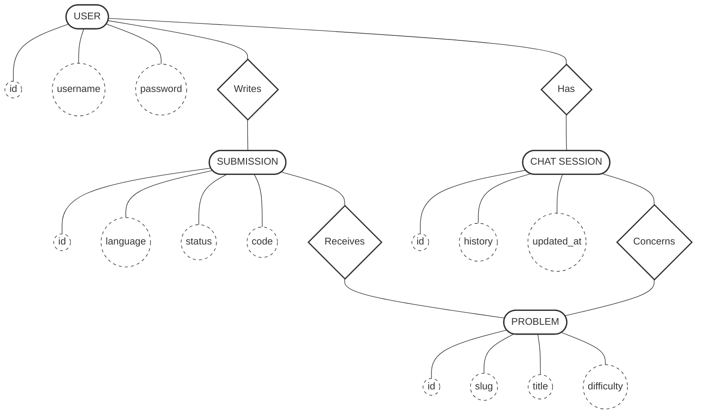

# Entity Relationship Diagram (Old School Style)

In this diagram:

- **Entities** are represented by **Ovals** `([ ])`.
- **Relationships** are represented by **Diamonds** `{ }`.
- **Attributes** are represented by **Circles** `(( ))`.

